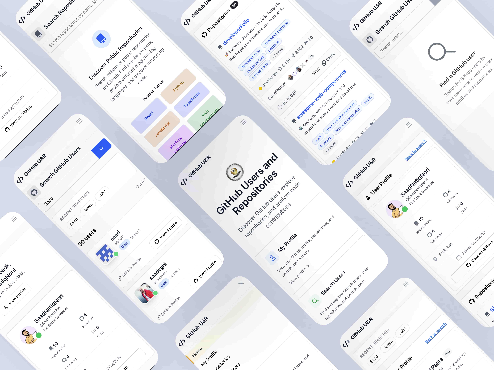
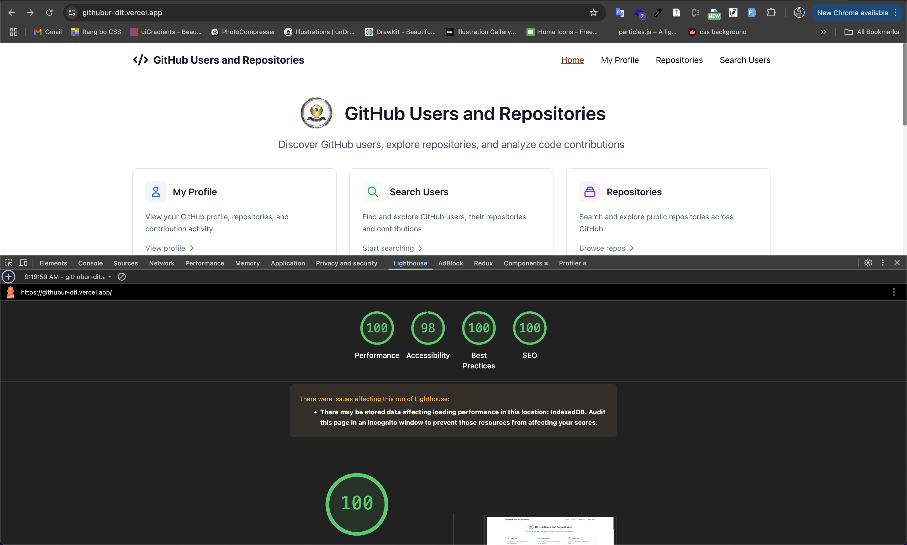

# GitHub Users & Repositories Explorer

A modern React + TypeScript application for exploring GitHub users and repositories built with Next.js, Redux Toolkit, and Tailwind CSS.

## 🚀 Features

- **User Search**: Search GitHub users by username with debounced input
- **Profile Views**: View detailed user profiles with stats and information
- **Repository Management**: Browse user repositories with sorting and filtering
- **Repository Search**: Search public repositories globally
- **Contributors Display**: View repository contributors with their contribution counts
- **Search History**: Local storage of search history for quick access
- **Responsive Design**: Fully responsive design for desktop and mobile
- **Loading States**: Comprehensive loading spinners and error handling
- **Modern UI**: Clean, modern interface with Tailwind CSS

## Tech Stack

- **Framework**: Next.js 14 (Pages Router)
- **Language**: TypeScript
- **State Management**: Redux Toolkit
- **HTTP Client**: Axios
- **Styling**: Tailwind CSS
- **UI Components**: Custom React components
- **Hooks**: Custom hooks for GitHub API and local storage

## Screenshots




## Requirements Met

✅ **Core Features**:
- Get current user profile and repositories
- Search GitHub users by username
- Display public repositories with details
- Loading and error handling

✅ **Bonus Features**:
- Debounced input (500ms delay)
- Sort/filter repositories by stars, language, updated date
- Store search history in localStorage
- Custom hooks (`useRepos`, `useDebounce`, `useLocalStorage`)
- Responsive design for desktop and mobile

✅ **Technical Requirements**:
- React 18+ functional components
- TypeScript throughout
- Tailwind CSS for consistent styling
- Axios for API calls
- Next.js with Pages Router
- Redux Toolkit for state management
- Proper React Hooks usage

## 🚀 Setup Instructions

1. **Clone the repository**:
   ```bash
   git clone <repository-url>
   cd github-users-repos
   ```

2. **Install dependencies**:
   ```bash
   npm install
   ```

3. **Setup GitHub Token**:
   - Go to [GitHub Personal Access Tokens](https://github.com/settings/personal-access-tokens)
   - Create a new token with `read:user` and `public_repo` scopes
   - Copy `.env.local.example` to `.env.local`
   - Add your token: `NEXT_PUBLIC_GITHUB_TOKEN=your_token_here`

4. **Run the development server**:
   ```bash
   npm run dev
   ```

5. **Open your browser**:
   Navigate to [http://localhost:3000](http://localhost:3000)

## 🏗️ Project Structure

```
├── components/
│   ├── ErrorMessage.tsx
│   ├── FilterControls.tsx
│   ├── LoadingSpinner.tsx
│   ├── Navigation.tsx
│   ├── RepositoryCard.tsx
│   ├── SearchInput.tsx
│   └── UserCard.tsx
├── constants/
│   └── helpers.ts
├── hooks/
│   ├── useDebounce.ts
│   ├── useLocalStorage.ts
│   └── useRepos.ts
├── lib/
│   └── api.ts
├── node_modules/ 🚫 (auto-hidden)
├── pages/
│   ├── api/
│   │   └── hello.ts
│   ├── _app.tsx
│   ├── _document.tsx
│   ├── index.tsx
│   ├── profile.tsx
│   ├── repositories.tsx
│   └── search.tsx
├── public/
│   ├── screenshots/
│   ├── favicon.ico
│   ├── file.svg
│   ├── globe.svg
│   ├── next.svg
│   ├── vercel.svg
│   └── window.svg
├── store/
│   ├── slices/
│   │   ├── repoSlice.ts
│   │   └── userSlice.ts
│   └── index.ts
├── styles/
│   └── globals.css
├── types/
│   └── github.ts
├── .env.local 🚫 (auto-hidden)
├── .gitignore
├── README.md
├── eslint.config.mjs
├── next-env.d.ts 🚫 (auto-hidden)
├── next.config.ts
├── package-lock.json
├── package.json
├── postcss.config.mjs
├── tailwind.config.js
└── tsconfig.json
```

## 🎯 Usage

1. **Home Page**: Overview with navigation to different features
2. **My Profile**: View your GitHub profile (requires token)
3. **Search Users**: Search and explore GitHub users
4. **Repositories**: Search public repositories globally

## ⏱️ Time Spent

Approximately 20-23 hours developing this application, including:
- Project setup and configuration (2.5 hours)
- API integration and type definitions (3.5 hours)
- Redux store and state management (3 hours)
- Custom hooks development (2 hours)
- UI components and styling (5 hours)
- Pages and routing (3.5 hours)
- Testing and refinement (3.5 hours)

## 🔧 Development Decisions

- **Next.js Pages Router**: Chosen for simplicity and SEO benefits
- **Redux Toolkit**: Provides excellent TypeScript support and reduces boilerplate
- **Custom Hooks**: Abstracts API logic and provides reusable functionality
- **Tailwind CSS**: Enables rapid UI development with consistent design
- **Debounced Search**: Reduces API calls and improves user experience
- **Local Storage**: Persists search history across sessions


## 📝 Additional Features

- Search history persistence
- Repository contributor visualization
- Responsive mobile design
- Language-based repository filtering
- Star count and fork display
- Direct links to GitHub repositories
- Error boundaries and loading states